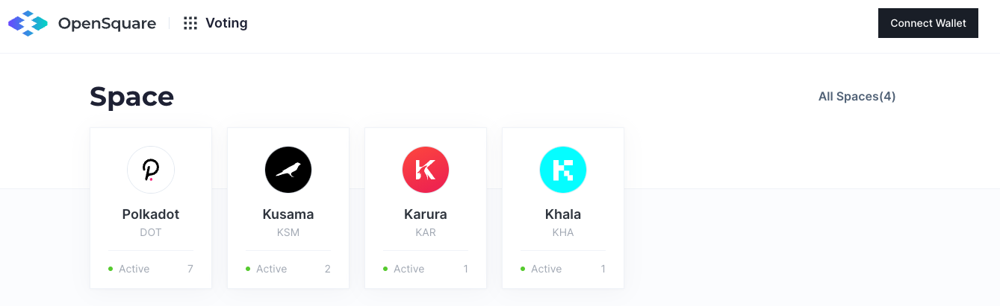
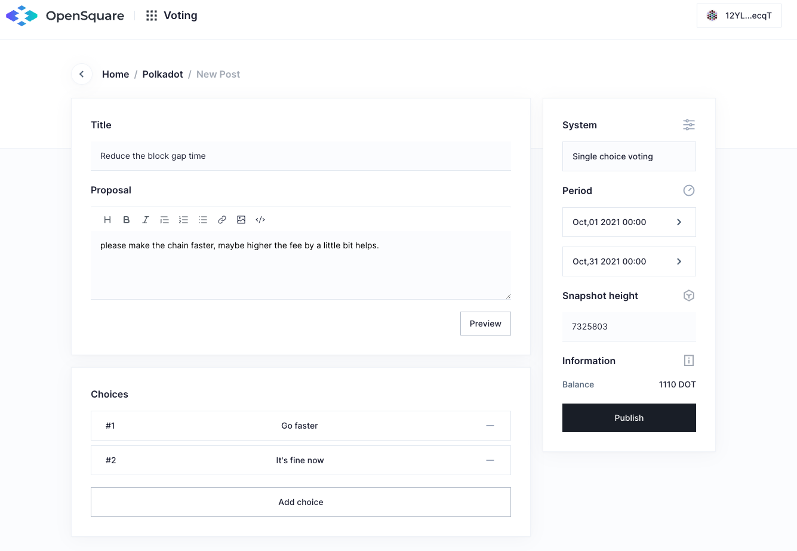

###  1. Requirements
Make sure you have gone through [Preparation](preparation) section first before creating a proposal. 
There are some minimum balance requirements to create a new proposal.
- Kusama: 0.01 KSM.
- Polkadot: 1 DOT.
- Karura: 1 KAR.
- Khala: 1 PHA.

### 2. Create a proposal  
Open [opensquare.io](http://www.opensquare.io/).   
  
Find and click the `Connect Wallet` button at the header. Select the address you want to use for the proposal(From `Polkadot Extension`).

After wallet connected, pick a space where the proposal wants to go, and find a `+ New Post` Button at the space page.

Now go to the creating proposal page, and complete the form for publishing it. The required items includes:
- Title
- Content
- Start and end date
- Snapshot height
- More than 2 choices

### 3. Publish

After a proposal published, the browser will be redirected to the proposal detail page, and you can share the link with any social media platform.  
You can check the post data is stored to IPFS.
