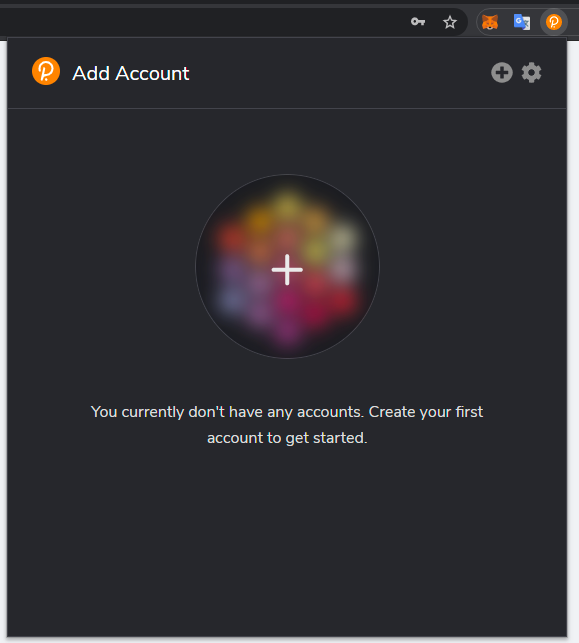
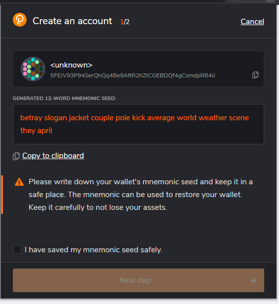

A key is required for decentralized voting. We assume that you have known [Polkadot Extension](https://chrome.google.com/webstore/detail/polkadot%7Bjs%7D-extension/mopnmbcafieddcagagdcbnhejhlodfdd) and installed it, while this tutorial will use it to manage your accounts. 
If you don't have it, please install and learn about it before starting.

## Get Polkadot{.js} extension
This browser extension manages accounts and empowers users to sign transactions. 

## Create Account
(Skip if you already have accounts).Open the Polkadot{.js} browser extension by clicking the logo on the top bar of your browser. You will see a browser popup, not unlike the one below.

  
Click the big plus button or select "Create new account" from the small plus icon in the top right. The Polkadot{.js} plugin will then use system randomness to make a new seed for you and display it to you in the form of twelve words.  

  
You should back up these words as explained above. It is imperative to store the seed somewhere safe, secret, and secure.
The next, you will be asked to set a name and a password for it.Then complete the account creation.

## Balance requirement

Your account have to be alive before any voting. Either polkadot, kusama, karura and khala has a minimum existential deposit requirement to keep your account alive.
So try to get some balance to your account.
