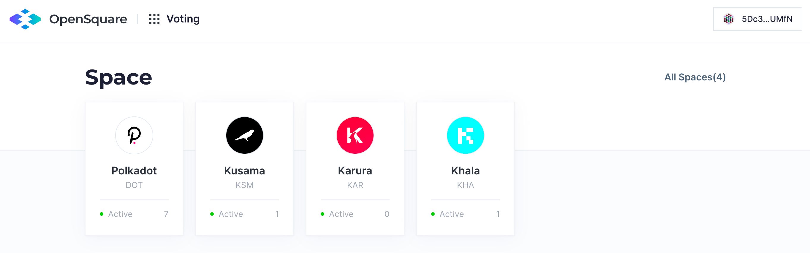

###  1. Preparation 
Make sure you have gone through [Preparation](preparation) section first before voting a proposal.

### 2. Goto the space 
Found a Space you're interested on the home page.

On the Space page, you can see some description about the Space (token symbol, network & etc...).
Also, be aware of the concept of Threshold and Strategy, which refers to the requirement to create proposal and how the results will be calculated.

### 3. Vote

All proposal details will be represented on the proposal detail page, check proposal options and case a vote if one matches you opinion.
One account can only cast one vote to a single proposal, re-casting a vote will override the last one.  
